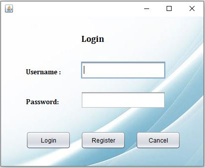
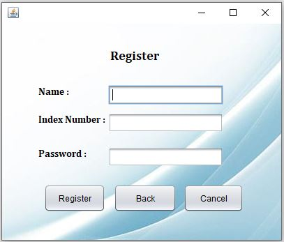
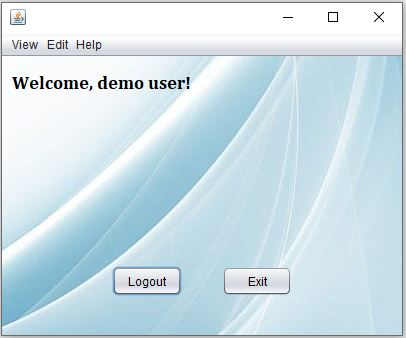
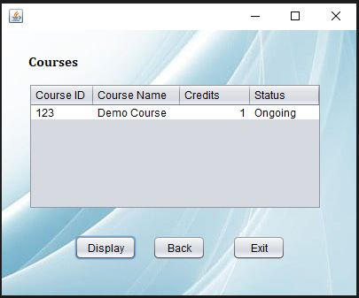
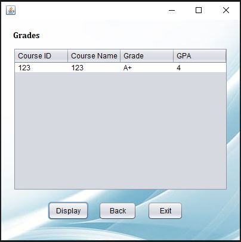
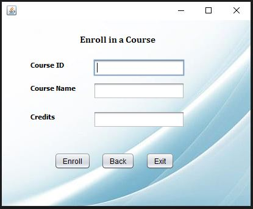
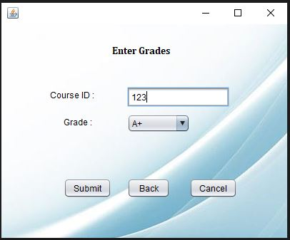
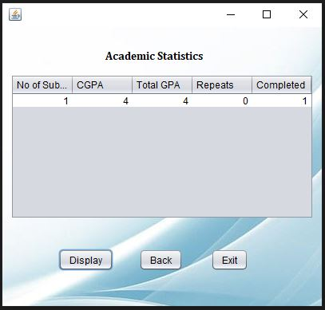

# Student Learning Management System

## Description
The Student Learning Management System (SLMS) is a Java Swing-based GUI application designed to streamline the management of student information and academic records. This system is ideal for students and educational institutions looking to maintain and track academic progress efficiently.
### Features
#### 1. Login Page
- Secure login with username and password for registered users

#### 2. Registration Page
- Simple registration process requiring a username, student name, and password

#### 3. Home Page
- Personalized greeting for each user.
- User-friendly menus for easy navigation.

#### 4. Menus
- View Enrolled Courses: Quickly access a list of courses you are currently enrolled in.
- View Grades: Check your grades for enrolled courses.
- Enroll in a New Course: Enroll in new courses with ease.
- Enter Grades for an Enrolled Course: Easily add grades for courses you have enrolled.
- Stats: View detailed statistics including the number of subjects, CGPA, total GPA, number of repeats, and number of passed courses.

## Screenshots
### Login Page

### Register page

### Home page

### Courses

### Grades

### Enroll in a course

### Enter Grades

### Stats

